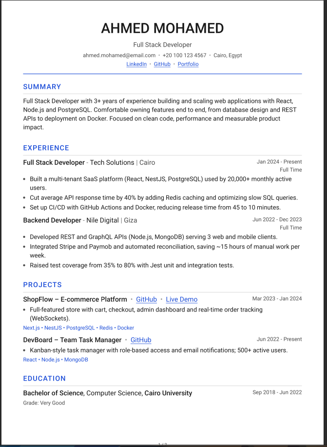
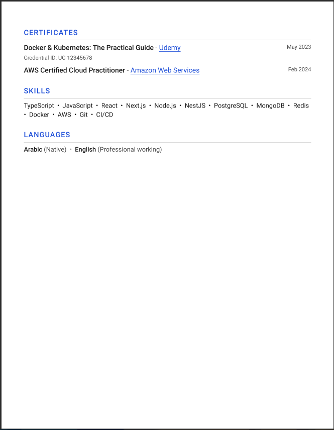
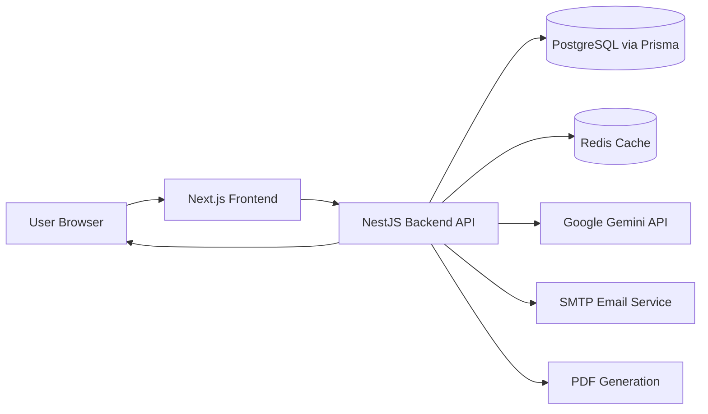
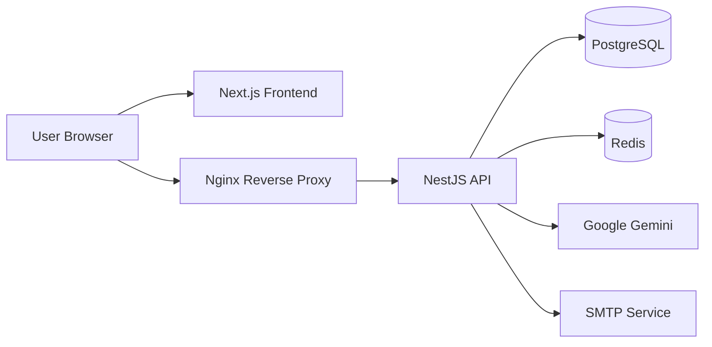

# CareerPilot

CareerPilot is an AI-powered career platform for creating, managing, optimizing, and exporting professional resumes.

Users can maintain a structured career profile, select the experience and qualifications they want to include, create resumes manually or from job descriptions, optimize resume content with Google Gemini, and download professionally formatted PDF resumes.

Authentication, career profile data, resume content, and usage records are persisted through the backend API.

## Live Demo

[Open the live demo](https://free-career-pilot.duckdns.org). The demo server has
limited resources, so response times and availability may vary.

## Features

### Authentication and Account Management

* Email registration with OTP-based verification
* Login and logout
* Refresh-token rotation
* Logout from all devices
* Password reset with OTP verification
* Google OAuth 2.0
* HTTP-only refresh-token cookies
* Protected dashboard and API routes
* Request throttling and validation

### Career Profile Management

* Personal profile and contact information
* Profile links
* Skills
* Work experience
* Projects
* Education
* Certificates
* Spoken languages
* Structured career data reusable across multiple resumes

### Resume Creation

* Resume CRUD operations
* Select profile data to include in each resume
* Create resumes manually or from a job description
* Gemini-powered resume optimization
* AI-generated professional summaries
* Professional resume layout with English and Arabic output
* Live resume preview
* Authenticated PDF generation and download
* Arabic right-to-left text support
* Arabic text reshaping and bidirectional-text handling in generated PDFs

### AI and Platform Capabilities

* Bring Your Own Gemini API Key (BYOK)
* User-provided Gemini API keys are encrypted before being stored and are used by the backend for AI-powered resume generation and optimization
* Optional server-level Gemini API fallback
* Monthly usage limits for server-level Gemini usage
* Retry handling with exponential backoff for selected transient Gemini failures
* PostgreSQL persistence through Prisma
* Redis cache-aside caching for profile and resume data
* SMTP-backed verification and password-reset email flows
* Request validation and whitelisting
* Security headers with Helmet
* CORS allow-listing
* Global exception handling
* Docker Compose configurations for development and production

## Screenshots

The application generates professionally formatted resumes with support for both English and Arabic content.

<p align="center">
  
  
</p>

## Tech Stack

### Frontend

* Next.js 16 with the App Router
* React 19
* TypeScript
* Tailwind CSS 4
* Axios for direct browser-to-backend API communication
* React Hook Form
* Zod
* lucide-react
* Client-side English/Arabic localization
* RTL support
* Light and dark themes

### Backend

* NestJS 11
* Node.js
* TypeScript
* Prisma 6
* PostgreSQL
* Passport
* JWT
* Google OAuth 2.0
* class-validator
* class-transformer
* bcrypt
* Helmet
* cookie-parser
* NestJS throttling
* Nodemailer
* pdfmake
* Arabic text reshaping and bidirectional-text support
* Google Gemini through `@google/genai`

### Infrastructure and Services

* PostgreSQL
* Redis
* ioredis
* Nest cache manager
* Docker
* Docker Compose
* Nginx reverse proxy for production

## Architecture

The frontend communicates directly with the NestJS backend API.

The backend coordinates authentication and domain services, persists structured career and resume data in PostgreSQL, uses Redis for cache-aside reads, communicates with Google Gemini for AI-assisted resume operations, sends transactional emails through SMTP, and generates PDF resumes for authenticated users.



### Production Architecture

In the production environment, Nginx acts as the public entry point and reverse proxy for the backend API.

PostgreSQL and Redis remain private service dependencies inside the Docker environment.



The frontend is deployed and served separately from the backend production
stack as a Next.js application (built with `npm run build` and served with
`npm run start`). The repository does not require a specific frontend hosting
provider; the live demo uses `https://free-career-pilot.duckdns.org`.

### HTTPS and production domains

The backend Nginx configuration redirects HTTP port `80` to HTTPS port `443`
and terminates TLS using certificates provisioned by Certbot and mounted from
`backend/certbot/conf`. It then proxies API requests to the internal NestJS
service on port `8000`; the production Compose file publishes both `80` and
`443`.

## Project Structure

```text
career-pilot/
│
├── backend/
│   ├── prisma/              # Prisma schema and migrations
│   ├── src/                 # NestJS modules, controllers, and services
│   ├── compose.dev.yml      # Backend development Compose overlay
│   ├── compose.prod.yml     # Backend production Compose overlay
│   └── README.md            # Backend setup and API documentation
│
├── frontend/
│   ├── app/                 # Next.js routes and application pages
│   ├── components/          # Shared UI components
│   ├── services/            # API clients and validation schemas
│   ├── views/               # Screen-level view components
│   └── README.md            # Frontend setup and architecture notes
│
└── README.md
```

## Getting Started

### Prerequisites

* Node.js 20 or newer for the frontend
* Node.js 24 or a compatible runtime for the backend Docker image
* npm
* Docker
* Docker Compose

### Start the Backend and Infrastructure

The development Compose configuration starts PostgreSQL, Redis, and the NestJS backend.

From the repository root:

```bash
cd backend

cp .env.example .env

# Edit .env and provide the required secrets and service settings.

docker compose -f docker-compose.yml -f compose.dev.yml up --build
```

The backend API is available at:

```text
http://localhost:8000
```

The development Compose overlay runs Prisma migrations before starting the NestJS development server.

### Start the Frontend

Open a second terminal:

```bash
cd frontend

cp .env.example .env

# Set NEXT_PUBLIC_API_URL=http://localhost:8000

npm ci
npm run dev
```

The frontend is available at:

```text
http://localhost:3000
```

The browser communicates directly with the backend API, so `CORS_ORIGIN` in `backend/.env` must include the exact frontend origin.

For production deployments where the frontend and backend are hosted on different origins, configure the backend cookie and HTTPS settings according to the backend documentation.

## Useful Commands

### Frontend

```bash
cd frontend

npm run build
npm run start
npm run lint
```

### Backend

```bash
cd backend

npm run build
npm run start:dev
npm run test
npm run test:e2e
```

### Stop the Development Environment

```bash
cd backend

docker compose -f docker-compose.yml -f compose.dev.yml down
```

### Start the Production Backend Stack

```bash
cd backend

docker compose -f docker-compose.yml -f compose.prod.yml up -d
```

The production configuration includes the backend image, PostgreSQL, Redis, and Nginx.

The frontend is built and served separately using its production commands.

## Environment Variables

Copy the example environment files before running each application.

### Backend

[`backend/.env.example`](backend/.env.example) documents configuration for:

* Database connection
* JWT secrets and token lifetimes
* SMTP
* CORS
* Request throttling
* Gemini
* Google OAuth
* Redis
* Gemini encryption

### Frontend

[`frontend/.env.example`](frontend/.env.example) defines:

```text
NEXT_PUBLIC_API_URL
```

which specifies the public base URL of the backend API.

Do not commit populated `.env` files or secrets.

`GEMINI_ENCRYPTION_KEY` is required by the backend when storing user-provided Gemini API keys.

SMTP and Google OAuth variables are only required when their corresponding flows are enabled.

## Security

CareerPilot applies several security measures across authentication, API requests, and sensitive user data.

* HTTP-only refresh-token cookies
* Refresh-token rotation
* Bcrypt-hashed refresh tokens
* Bcrypt password hashing
* AES-256-GCM encryption for user-provided Gemini API keys
* Scrypt-derived encryption key material
* DTO validation and request-property whitelisting
* Helmet security headers
* CORS allow-listing
* Request throttling
* Protected API routes
* Global exception handling

## Engineering Highlights

* Refresh tokens are rotated and stored as bcrypt hashes while the browser receives the active refresh token through an HTTP-only cookie.
* DTO validation rejects non-whitelisted request properties.
* Global exception handling and response interception provide consistent API behavior.
* Redis uses a cache-aside strategy for profile and resume reads.
* Related cache entries are invalidated after profile and resume mutations.
* User-provided Gemini API keys are encrypted with AES-256-GCM using scrypt-derived key material before being persisted in PostgreSQL.
* AI requests retry selected transient Gemini failures using exponential backoff.
* Usage records enforce monthly generation limits when users rely on the server-level Gemini API key.
* The backend is containerized with health-checked PostgreSQL and Redis services.
* The production Compose configuration places Nginx in front of the backend API.
* Arabic resume generation handles right-to-left text, reshaping, and bidirectional text before PDF generation.

```bash
cd backend

npm run test
npm run test:e2e
```

## Documentation

* [Backend Documentation](backend/README.md)
* [Frontend Documentation](frontend/README.md)

## Contributors and Acknowledgments

Thanks to [Abdallah Bakr](https://github.com/Abdallah-m-Bakr) for building
the frontend and helping bring CareerPilot to life.

## Engineering Scope

CareerPilot was built to demonstrate practical backend and full-stack engineering concepts, including:

* Authentication and session management
* OAuth integration
* Relational database design
* Prisma ORM
* Redis caching and cache invalidation
* Third-party API integration
* AI API integration with Google Gemini
* Secure storage of user-provided API credentials
* Retry and failure-handling strategies
* PDF generation
* Arabic text processing
* REST API design
* Request validation and security
* Dockerized development and production deployment
* Nginx reverse proxy configuration
* Frontend-to-backend API communication
