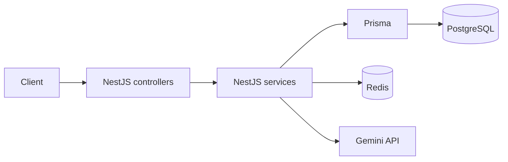
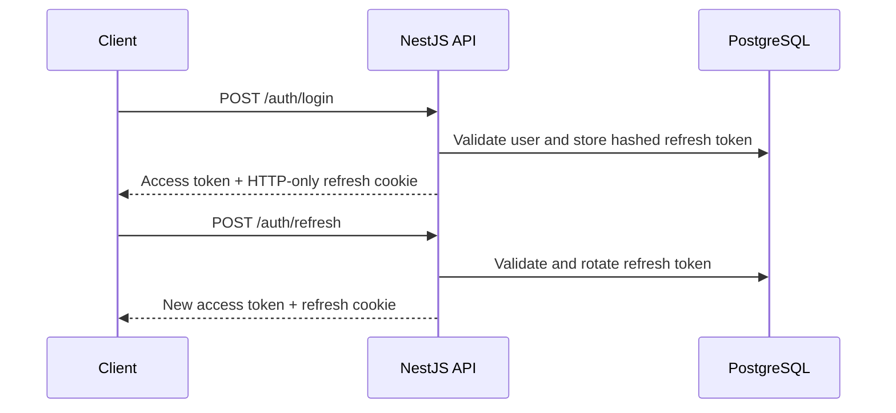
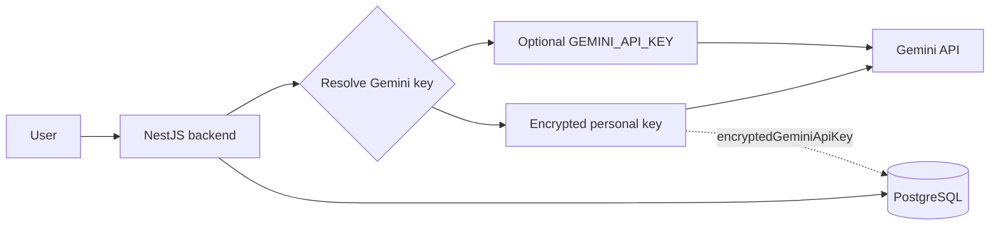

# CareerPilot Backend

## Overview

CareerPilot is a NestJS backend for building, optimizing, and exporting
professional resumes. It provides account management, profile data management,
resume CRUD, Gemini-powered resume optimization, and PDF generation.

The service exposes authenticated APIs backed by PostgreSQL and Prisma. Redis
is available for application caching and direct key/value operations.

## Features

- Registration, email verification, and password reset
- JWT authentication with refresh-token rotation
- Google OAuth 2.0
- HTTP-only refresh-token cookies
- Account lockout fields and route-level rate limiting
- User profile and career-history management
- Resume/CV CRUD and profile-data associations
- Professional resume/CV generation with a single layout
- AI resume optimization against a job description
- User-provided Gemini API keys (BYOK)
- AES-256-GCM encrypted Gemini API-key storage
- Redis caching and key/value helpers
- Usage tracking and monthly generation limits
- Dockerized development and production environments

## Tech Stack

| Area | Technology |
| --- | --- |
| Framework | NestJS 11 |
| Language | TypeScript |
| Runtime | Node.js 24 |
| Database | PostgreSQL |
| ORM | Prisma 6 |
| Cache/client | Redis, `ioredis` |
| Authentication | Passport, JWT, Google OAuth 2.0 |
| Validation | `class-validator`, `class-transformer` |
| HTTP security | Helmet |
| Password/token hashing | bcrypt |
| Email | Nodemailer |
| PDF generation | pdfmake |
| AI | Google Gemini API (`@google/genai`) |
| Infrastructure | Docker |

## Architecture

Controllers receive HTTP requests and delegate application behavior to
services. Services use Prisma for PostgreSQL persistence, Redis for cache and
key/value operations, and Gemini for AI-assisted resume optimization.



## Project Structure

```text
src/
├── auth/          # Registration, login, JWT, Google OAuth, OTP flows
├── users/         # User persistence helpers
├── profile/       # User profile management
├── contact-info/  # Contact details and profile links
├── skill/         # Skills
├── experience/    # Work experience
├── project/       # Projects
├── education/     # Education
├── certificate/   # Certificates
├── language/      # Spoken languages
├── resume/        # Resume CRUD and AI-created resumes
├── pdf/           # PDF mapping, templates, and generation
├── ai/            # Resume optimization and Gemini-key endpoints
├── gemini/        # Gemini API-key encryption and resolution
├── cache/         # Nest cache manager and Redis services
├── token/         # Access, refresh, and reset token operations
├── otp/           # OTP persistence and verification support
├── email/         # SMTP service and email templates
├── prisma/        # Prisma client module
└── usage/         # Usage records and monthly generation checks
```

## Authentication

The authentication module supports local credentials and Google OAuth:

- `POST /auth/register` creates an account.
- Email verification uses OTPs sent through the configured email service.
- Login issues a short-lived access token and a refresh token in an HTTP-only
  cookie.
- Refresh tokens are rotated and stored in PostgreSQL as bcrypt hashes.
- `POST /auth/logout` invalidates the current device's refresh token.
- `POST /auth/logout-all` invalidates all refresh tokens for the user.
- Password reset uses a reset OTP followed by a short-lived reset JWT.
- Google OAuth is handled by `/auth/google` and `/auth/google/callback`.
- JWT guards protect authenticated routes.
- Failed-login/account-lockout fields are stored on the user record.
- Global throttling is configured, with stricter limits on authentication
  routes.



## AI Integration

CareerPilot primarily uses a BYOK model: users can configure their own Gemini
API key through the authenticated AI endpoints:

- `POST /ai/gemini-key` sets a key.
- `PUT /ai/gemini-key` updates a key.
- `DELETE /ai/gemini-key` removes a key.
- `GET /ai/gemini-key/status` reports whether a personal key is configured.

Keys are encrypted before persistence:

- AES-256-GCM encrypts the normalized key.
- The encryption key is derived with `scrypt`.
- Only the encrypted value is stored in the `User.encryptedGeminiApiKey`
  field.

The effective Gemini key is resolved in this order:

1. The user's personal encrypted Gemini key
2. The optional server-level `GEMINI_API_KEY` fallback

The configured model defaults to `gemini-2.5-flash`. Requests retry transient
Gemini failures with exponential backoff for statuses 429, 500, 502, 503, and
504. `POST /ai/optimize-resume` sends the user's profile and a job description
to Gemini and parses the returned resume-selection data.

When no personal key is configured, the service may use the optional server
fallback. The monthly CV and job-description usage limits also apply in this
case; users with a personal Gemini key do not consume those tracked
allowances in the current implementation.



## Resume & CV System

The resume module supports:

- Resume create, list, retrieve, update, and delete operations
- Manual resume creation from profile records
- AI-optimized resume creation from a job description
- Resume-to-profile associations for skills, experience, projects, education,
  certificates, and languages
- Optional job descriptions and generated summaries
- Authenticated PDF generation through `GET /pdf/:resumeId`

The current user-facing design uses a single professional resume layout.
Supported resume languages are English (`EN`) and Arabic (`AR`). The PDF
implementation includes Arabic text reshaping and bidirectional text support.

## Usage Limits

The backend currently tracks usage in PostgreSQL and enforces:

- **2 CV generations per month**
- **2 job-description generations per month**

These limits are enforced when the user does not have a personal Gemini API
key. Usage is represented by the `Usage` model.

## Database

Prisma connects the service to PostgreSQL using `DATABASE_URL`. The main
entities are:

`User`, `Profile`, `ContactInfo`, `ProfileLink`, `Skill`, `Experience`,
`Project`, `Education`, `Certificate`, `Language`, `Resume`, `RefreshToken`,
`Otp`, and `Usage`.

Profiles own career-history records and resumes. Resumes connect selected
profile records through dedicated relation models. Users own refresh tokens,
OTPs, usage records, and the encrypted `encryptedGeminiApiKey` value.

## Caching

The Redis module uses `ioredis` and defaults to `localhost:6379`. It provides:

- `set`, `get`, `delete`, and `exists`
- JSON serialization and deserialization helpers
- Optional TTL support
- SCAN-based pattern deletion

The project also registers Nest's cache manager globally with a default TTL of
60 seconds. The current source does not define a separate list of business
objects cached by the application.

## API

All profile, career-data, resume, PDF, and AI endpoints are protected by the
JWT guard unless stated otherwise. The application does not currently include
Swagger/OpenAPI configuration.

### Authentication

| Method | Endpoint | Description |
| --- | --- | --- |
| POST | `/auth/register` | Register |
| POST | `/auth/verify-email` | Verify email OTP |
| POST | `/auth/resend-verification-otp` | Resend verification OTP |
| POST | `/auth/login` | Login |
| POST | `/auth/refresh` | Rotate refresh token |
| POST | `/auth/logout` | Log out current device |
| POST | `/auth/logout-all` | Log out all devices |
| POST | `/auth/forgot-password` | Start password reset |
| POST | `/auth/verify-reset-otp` | Verify reset OTP |
| POST | `/auth/reset-password` | Complete password reset |
| GET | `/auth/me` | Get current user |
| GET | `/auth/google` | Start Google OAuth |
| GET | `/auth/google/callback` | Complete Google OAuth |

### Profile and career data

| Resource | Endpoints |
| --- | --- |
| Profile | `POST /profile`, `GET /profile`, `PATCH /profile`, `DELETE /profile` |
| Contact info | `POST /contact-info`, `GET /contact-info`, `PATCH /contact-info`, `DELETE /contact-info` |
| Skills | `POST /skill`, `GET /skill`, `GET /skill/:id`, `PATCH /skill/:id`, `DELETE /skill/:id` |
| Experience | `POST /experience`, `GET /experience`, `GET /experience/:id`, `PATCH /experience/:id`, `DELETE /experience/:id` |
| Projects | `POST /project`, `GET /project`, `GET /project/:id`, `PATCH /project/:id`, `DELETE /project/:id` |
| Education | `POST /education`, `GET /education`, `GET /education/:id`, `PATCH /education/:id`, `DELETE /education/:id` |
| Certificates | `POST /certificate`, `GET /certificate`, `GET /certificate/:id`, `PATCH /certificate/:id`, `DELETE /certificate/:id` |
| Languages | `POST /language`, `GET /language`, `GET /language/:id`, `PATCH /language/:id`, `DELETE /language/:id` |

### Resumes, PDF, and AI

| Method | Endpoint | Description |
| --- | --- | --- |
| POST | `/resume` | Create a resume |
| POST | `/resume/by-job-description` | Create an AI-optimized resume |
| GET | `/resume` | List resumes |
| GET | `/resume/:resumeId` | Get a resume |
| PATCH | `/resume/:resumeId` | Update a resume |
| DELETE | `/resume/:resumeId` | Delete a resume |
| GET | `/pdf/:resumeId` | Download a resume PDF |
| POST | `/ai/optimize-resume` | Optimize resume data with Gemini |
| POST | `/ai/gemini-key` | Set a Gemini key |
| PUT | `/ai/gemini-key` | Update a Gemini key |
| DELETE | `/ai/gemini-key` | Clear a Gemini key |
| GET | `/ai/gemini-key/status` | Check personal-key status |

## Environment Variables

| Variable | Purpose | Required |
| --- | --- | --- |
| `DATABASE_URL` | PostgreSQL connection string | Yes |
| `JWT_ACCESS_SECRET` | Access-token signing secret | Yes |
| `JWT_REFRESH_SECRET` | Refresh-token signing secret | Yes |
| `JWT_RESET_SECRET` | Reset-token signing secret | Yes |
| `JWT_ACCESS_EXPIRES_IN` | Access-token lifetime; defaults to `15m` | No |
| `JWT_REFRESH_EXPIRES_IN` | Refresh-token lifetime; defaults to `7d` | No |
| `JWT_RESET_EXPIRES_IN` | Reset-token lifetime; defaults to `15m` | No |
| `SMTP_HOST` | SMTP server host | No |
| `SMTP_PORT` | SMTP server port | No |
| `SMTP_USER` | SMTP username | No |
| `SMTP_PASSWORD` | SMTP password | No |
| `SMTP_FROM` | Sender address | No |
| `SMTP_SECURE` | SMTP TLS setting | No |
| `BCRYPT_SALT_ROUNDS` | bcrypt cost; defaults to `12` | No |
| `THROTTLE_TTL` | Global throttle window | No |
| `THROTTLE_LIMIT` | Global throttle request limit | No |
| `NODE_ENV` | Runtime environment | No |
| `APP_URL` | Application URL | No |
| `CORS_ORIGIN` | Comma-separated allowed frontend origins | No |
| `GEMINI_API_KEY` | Optional server-level Gemini fallback | No |
| `GEMINI_MODEL` | Gemini model; defaults to `gemini-2.5-flash` | No |
| `GEMINI_ENCRYPTION_KEY` | Key material for encrypting user Gemini keys | Yes |
| `GOOGLE_CLIENT_ID` | Google OAuth client ID | OAuth only |
| `GOOGLE_CLIENT_SECRET` | Google OAuth client secret | OAuth only |
| `GOOGLE_REDIRECT_URI` | Google OAuth callback URL | OAuth only |
| `REDIS_HOST` | Redis host; defaults to `localhost` | No |
| `REDIS_PORT` | Redis port; defaults to `6379` | No |
| `PORT` | HTTP port; defaults to `3000` in `src/main.ts` | No |

`.env.example` also contains optional `DATABASE_SEED`, `LOG_LEVEL`,
`REDIS_URL`, and `QUEUE_ENABLED` placeholders. The current application source
does not use those values to configure an active queue or seed workflow.

## Getting Started

### Prerequisites

For local development:

- Node.js 24 or a compatible Node.js runtime
- npm
- PostgreSQL
- Redis

For Docker-based development or production, Docker and Docker Compose are
required instead.

### Installation

```bash
npm install
```

### Environment Configuration

Copy `.env.example` to `.env` and provide the required database, JWT, and
Gemini encryption settings. Add SMTP and Google OAuth settings when those
features are needed.

### Prisma

Generate the Prisma client:

```bash
npx prisma generate
```

Apply existing migrations in a development database:

```bash
npx prisma migrate deploy
```

### Run

```bash
npm run start:dev
```

The application defaults to port `3000` unless `PORT` is set.

## Docker

CareerPilot provides separate Docker Compose configurations for infrastructure,
development, and production environments.

### Docker Compose Files

| File                 | Purpose                                    |
| -------------------- | ------------------------------------------ |
| `docker-compose.yml` | PostgreSQL and Redis infrastructure        |
| `compose.dev.yml`    | Development backend configuration          |
| `compose.prod.yml`   | Production backend and Nginx configuration |
| `Dockerfile`         | Builds the NestJS backend image            |

### Development

The development setup combines the infrastructure Compose file with
`compose.dev.yml`.

```bash
cp .env.example .env
```

Configure the required environment variables in `.env`, then start the
development environment:

```bash
docker compose -f docker-compose.yml -f compose.dev.yml up --build
```

The development backend:

* Runs on port `8000`
* Uses `npm run start:dev`
* Automatically runs `npx prisma migrate deploy` before starting
* Connects to PostgreSQL through the `postgres` service
* Connects to Redis through the `redis` service
* Mounts the source directory for development

The services are:

```text
Backend:    http://localhost:8000
PostgreSQL: localhost:5432
Redis:      localhost:6379
```

Stop the development environment:

```bash
docker compose -f docker-compose.yml -f compose.dev.yml down
```

Remove the containers and persisted PostgreSQL/Redis volumes:

```bash
docker compose -f docker-compose.yml -f compose.dev.yml down -v
```

### Production

The production setup combines the infrastructure Compose file with
`compose.prod.yml`.

The production backend uses the prebuilt Docker image:

```text
moazsayed/career-pilot-backend
```

and Nginx acts as the public entry point.

```text
Client
  |
  v
Nginx :80
  |
  v
Backend :8000
  |
  +--> PostgreSQL :5432
  |
  +--> Redis :6379
```

Start the production environment:

```bash
docker compose -f docker-compose.yml -f compose.prod.yml up -d
```

The production setup provides:

* Prebuilt backend Docker image
* PostgreSQL 18 Alpine
* Redis 8 Alpine with AOF persistence
* Nginx reverse proxy
* PostgreSQL and Redis health checks
* Backend access internally on port `8000`
* Public HTTP access through Nginx on port `80`

The backend is not directly published to the host in production; it is exposed
internally to Nginx.

Stop the production environment:

```bash
docker compose -f docker-compose.yml -f compose.prod.yml down
```

Remove the containers and persisted PostgreSQL/Redis volumes:

```bash
docker compose -f docker-compose.yml -f compose.prod.yml down -v
```

### Dockerfile

The `Dockerfile` builds the production backend image using Node.js 24 Alpine.

The image:

1. Installs dependencies with `npm ci`
2. Copies the Prisma schema
3. Generates the Prisma client
4. Copies the application source
5. Builds the NestJS application
6. Exposes port `8000`
7. Starts the compiled application with `npm run start:prod`

Prisma migrations are handled by the Compose configuration rather than the
Dockerfile itself.

### Local vs Docker Ports

```text
Local development:
npm run start:dev -> http://localhost:3000

Docker development:
backend -> http://localhost:8000

Docker production:
nginx -> http://localhost:80
backend -> internal port 8000
```

## Security

- bcrypt password hashing
- bcrypt hashing for stored refresh tokens
- Separate JWT secrets and expiration settings for access, refresh, and reset
  tokens
- HTTP-only refresh-token cookies
- Helmet security headers
- CORS with credentials and an origin allow-list
- DTO validation with whitelist and non-whitelisted-property rejection
- Global and route-specific rate limiting
- Account lockout fields for failed login attempts
- AES-256-GCM encryption for stored Gemini keys
- scrypt key derivation for Gemini-key encryption

## Useful Commands

| Command | Purpose |
| --- | --- |
| `npm run build` | Build the application |
| `npm run format` | Format source files |
| `npm run start` | Start normally |
| `npm run start:dev` | Start in watch mode |
| `npm run start:debug` | Start in debug watch mode |
| `npm run start:prod` | Start the compiled application |
| `npm run lint` | Run ESLint with auto-fix |

## Project Status

This repository contains the CareerPilot backend, including authentication,
profile and career-data APIs, resume management, Gemini integration, PDF
generation, Redis support, and PostgreSQL persistence.

## License

No project license is declared in `package.json` or the repository files.
